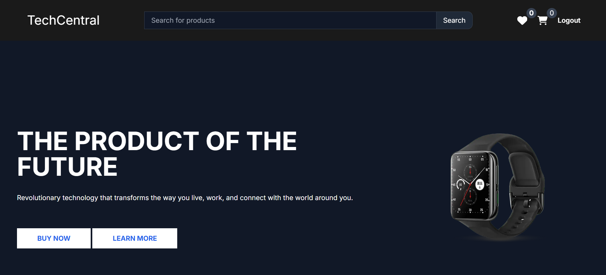
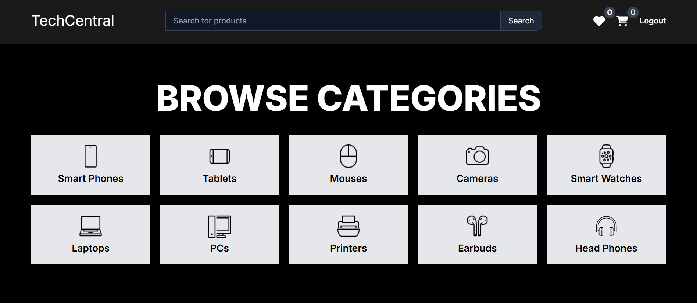
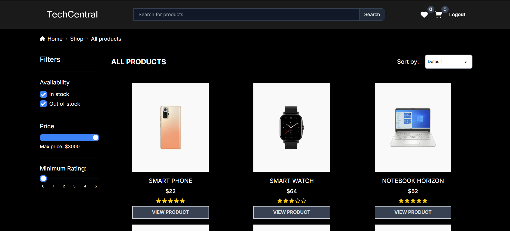
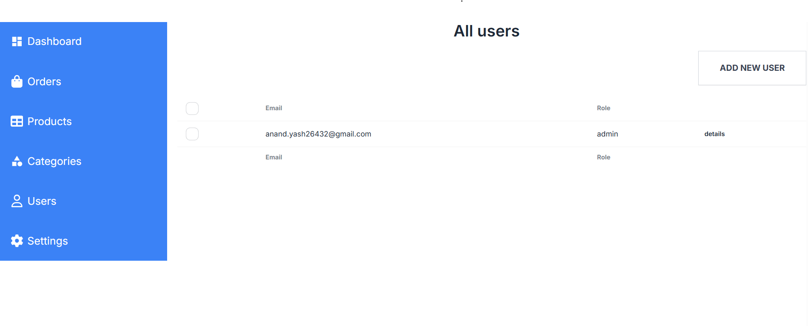
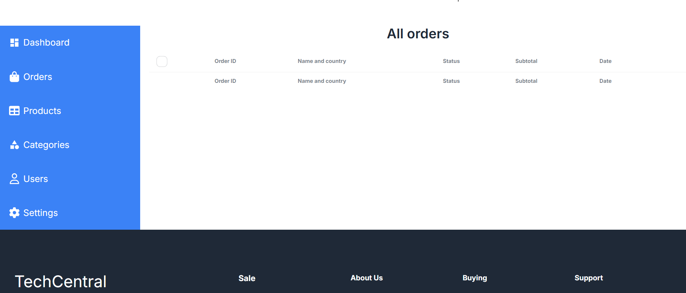
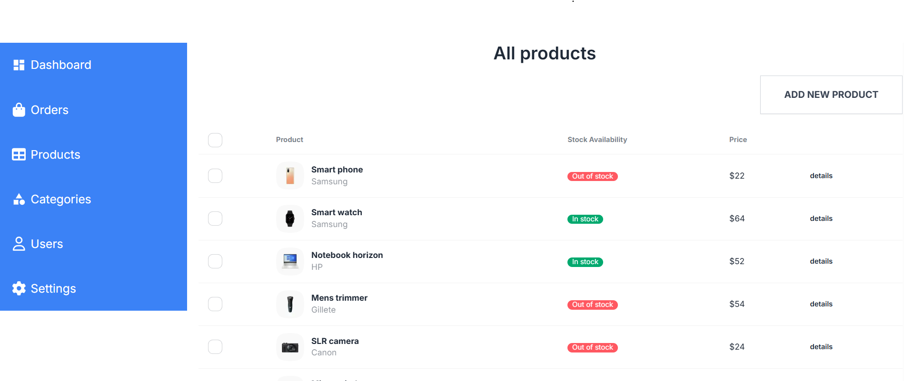
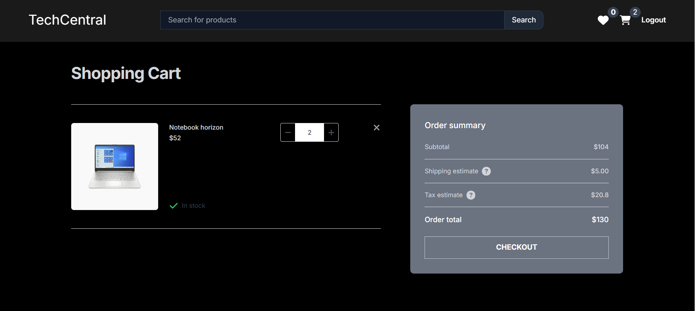
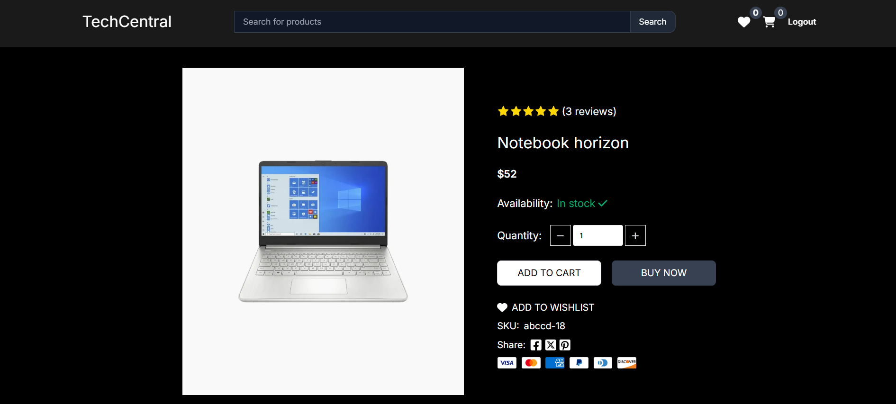

# Electronics eCommerce Shop With Admin Dashboard

Singitronic is a modern, fully responsive online electronics store built with Next.js, Node.js, and MySQL. The project features a custom design, robust admin dashboard, and a seamless shopping experience for customers. This application was developed from scratch as part of a college software engineering exam, following best practices in both software design and project management.

---

## Project Overview

**Purpose:**  
To create a contemporary eCommerce platform specializing in electronic products, featuring both customer-facing and admin functionalities.

**Key Features:**  
- Custom, responsive user interface  
- Product browsing and search  
- Detailed product views  
- Shopping cart and checkout  
- Secure authentication  
- Comprehensive admin dashboard for product, order, and user management  
- Built from scratch with a focus on maintainable, well-documented code

---

## Development Process

- **Software Engineering Model:**  
  The project followed the **Waterfall (Cascade) Model**, ensuring structured progression through requirements analysis, design, implementation, testing, and deployment.

- **Project Management:**  
  Managed using Plaky for task tracking and milestone planning.

- **Design & Architecture:**  
  - **Frontend:** Next.js  
  - **Backend:** Node.js with Prisma ORM  
  - **Database:** MySQL  
  - **UI/UX:** Custom Figma designs, fully responsive layout  
  - **Testing:** Manual, unit, integration, and end-to-end testing with detailed documentation

---

## Screenshots

> _Screenshots are located in the `/public/readme` folder._

### Homepage

### Browse Product / Catalogue Page

### Admin Pages

### Cart Page

### Product View Page

---

## Acknowledgements

- Developed as part of a software engineering course with guidance from professors.

---
